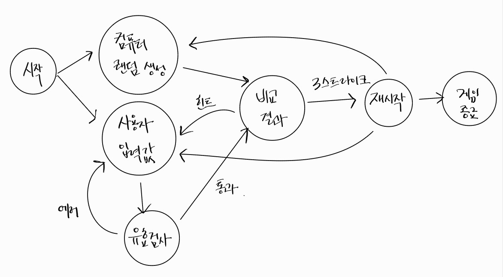

## 진행 방향

### 흐름도

### 시작

1. 컴퓨터가 1~9까지 서로 다른 3자리수 생성
2. Console API를 이용해 게임 시작 안내 문구 출력
   - "숫자 야구 게임을 시작합니다."

### 입력

3. 사용자가 3자리수 입력
   1. 입력값 유효성 검사 (Error)
      - 서로 다른 3자리
      - 숫자만 입력
      - throw문을 사용해 예외를 발생시킨후 애플리케이션은 종료
   2. 입력한 수 비교 (Hint)
      - 볼, 스트라이크 개수로 표시
      - 하나도 없는 경우
      - 3개의 숫자를 모두 맞힐 경우

### 종료

4. 게임이 끝난경우
   - 재시작/종료를 구분하는 1과 2 중 하나의 수
   - 재시작 입력값 유효성

 

## 분석

1. 컴퓨터가 숫자 생성
2. 사용자의 입력값 받기
3. 컴퓨터 vs 사용자 입력값 비교
4. 비교한 결과값을 출력
5. 게임 재시작 여부 확인

`예외처리` : 예외 상황 시 에러 문구를 출력해야 한다. 단, 에러 문구는 “[ERROR]“로 시작해야 한다.

 

## 현재 진행 상황

- [x] App안에 일단 다 구현하기
- [x] 콘솔로 게임 시작 보여주기
  - [x] Console API
- [x] [생성] 컴퓨터 3개 랜덤숫자
  - [x] Set 배열로 중복 제거
  - [x] 난수 생성은 라이브러리 사용
- [x] [생성] 사용자 3개 숫자 입력
  - [x] 유효 숫자 검사
  - [x] 에러메세지와 연계
- [x] 사용자 입력값 / 컴퓨터 입력값
  - [x] App 클래스에 적용 후 테스트
  - [x] 입력 비교
    - [x] 사용자 / 컴퓨터 모듈 분리
    - [x] 스트라이크 / 볼 은 갯수로 표시
- [x] 비교에 따른 출력
  - [x] 스트라이크, 볼, 낫싱
  - [x] 상수명 작성 필요
    - [x] 게임설정 (게임끝나고 재시작/종료), (볼 갯수)
    - [x] 메세지 (게임시작, 입력문구, 게임종료, 재시작)
- [x] 리팩토링 필요한가?
  - [x] 사용자 입력에 따른 비동기처리 / 출력으로 나뉨
- [x] 에러메세지 상수 작성
  - [x] 1~9까지
  - [x] 중복되지 않는 3자리수
  - [x] 재시작 숫자
- [x] 테스트 코드 실행

 

## 고민

1. 클래스

- random.js에서 static 의미?

  - static은 클래스의 인스턴스가 아닌 클래스 자체에 속하는 메소드

- 멤버 필드가 필요한가?
  - private(#), public(기본)
  - 수정하면 안되는 것이 있는지 생각해보기 -> 컴퓨터가 생성한 숫자 바뀌면 안됨 / 사용자

2. 분리

- 컴퓨터 / 사용자 클래스는 별도이기에 분리하는게 나아보임
- 상수값 변수가 생각보다 많아서 App.js에 지저분해짐
  - 프린트를 다 분리하는게 나을까?
  - init에 다 집어넣어 너무 많은 기능같다.
- View 파일로 출력은 분리

3. 테스트 에러

- 시작문구가 두번씩 출력되는데 이해가 되지않음

  1.  App.js 모듈 분리

  - App.js를 따로 다시 BaseballGame.js로 분리하니 해결됨
  - 정확하게 모르겠음 -> 클래스 play()를 하는 순간 App을 두번 호출하는건가?

  2. boolean 값으로 실행되는 순간 true로 바꿔주기

- 테스트코드에서 에러문구 `[ERROR]`가 무조건 들어가야 하는것을 몰랐다.
