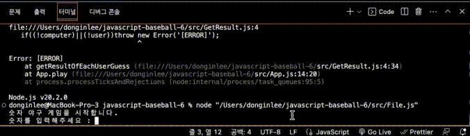

# 숫자 야구하기

코드 컨벤션, 파일 분리, 개발 환경 세팅

## 목차

- [About this repo](#About-this-repo)
- [기능 설명](#기능-설명)
- [코드 설명](#코드-설명)
- [사용](#사용)
- [소감문](#소감문)

## About this repo

이 레포지토리는 [우아한테크코스 6기 프리코스 1주차 과제](#https://github.com/woowacourse-precourse/javascript-baseball-6)를 위해 만들어졌습니다.

## 기능 설명

### 요약

기본적으로 1부터 9까지 서로 다른 수로 이루어진 3자리의 수를 맞추는 게임이다.

같은 수가 같은 자리에 있으면 스트라이크, 다른 자리에 있으면 볼, 같은 수가 전혀 없으면 낫싱이란 힌트를 얻고, 그 힌트를 이용해서 먼저 상대방(컴퓨터)의 수를 맞추면 승리한다.

### 예시

상대방(컴퓨터)의 수가 425일 때
123을 제시한 경우 : 1스트라이크
456을 제시한 경우 : 1볼 1스트라이크
789를 제시한 경우 : 낫싱

### 자세한 설명

위 숫자 야구 게임에서 상대방의 역할을 컴퓨터가 한다. 컴퓨터는 1에서 9까지 서로 다른 임의의 수 3개를 선택한다. 게임 플레이어는 컴퓨터가 생각하고 있는 서로 다른 3개의 숫자를 입력하고, 컴퓨터는 입력한 숫자에 대한 결과를 출력한다.
이 같은 과정을 반복해 컴퓨터가 선택한 3개의 숫자를 모두 맞히면 게임이 종료된다.
게임을 종료한 후 게임을 다시 시작하거나 완전히 종료할 수 있다.
사용자가 잘못된 값을 입력한 경우 throw문을 사용해 예외를 발생시킨후 애플리케이션은 종료되어야 한다.

### 입출력 요구사항

#### 입력

- 서로 다른 3자리의 수 예) 123, 456
- 게임이 끝난 경우 재시작/종료를 구분하는 1과 2 중 하나의 수 예) 1,2

#### 출력

- 게임 시작 문구 출력: 숫자 야구 게임을 시작합니다.
- 입력한 수에 대한 결과를 볼, 스트라이크 개수로 표시 예시) 1볼 1스트라이크, 1볼, 3스트라이크, 낫싱
- 3스트라이크가 나오는 경우, 게임 종료를 알리는 문구: 3개의 숫자를 모두 맞히셨습니다! 게임 종료
- 게임 종료 후 재시작 의사를 묻는 문구: 게임을 새로 시작하려면 1, 종료하려면 2를 입력하세요.

## 사용

### 사용 방법

우선 App.js의 App 클래스를 임포트 하고, App 클래스의 play 메서드를 사용하여 게임을 시작할 수 있다.

### 예시 코드

₩₩₩
import App from './App.js';

const app = new App;
app.play();

₩₩₩

### 예시 영상

  

