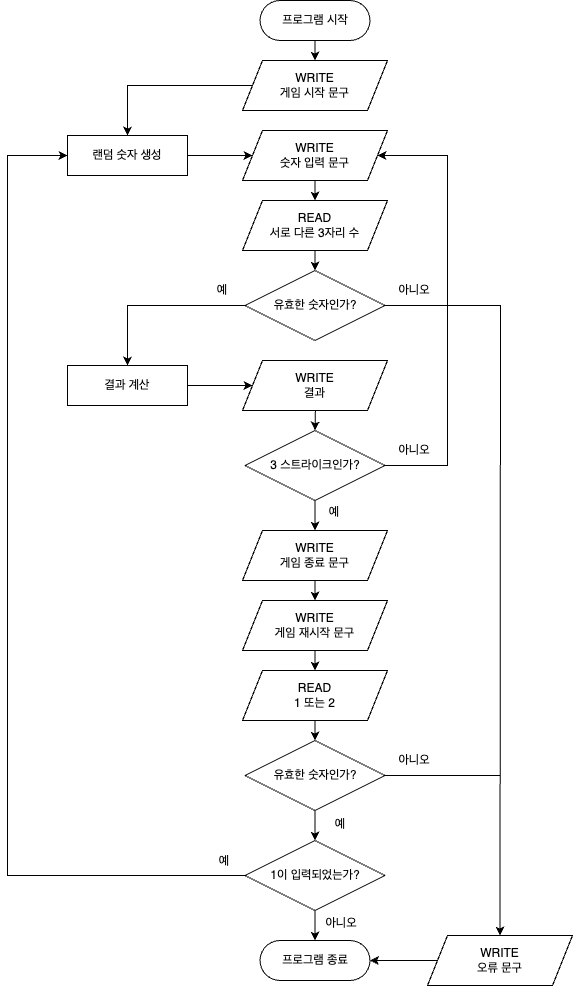

# ⚙️ '숫자 야구' 기능 목록

### ✅ 진행 상황 확인

- 🔴 진행 전
- 🟡 진행 중
- 🟢 진행 완료
- 🔵 리팩토링

### 🔗 Workflow



<br />

### 🟢 1. 게임 시작 문구 출력

- ✏️ 기능 설명

  게임을 시작하는 문구를 출력한다.

- 🚫 유의 사항

  - 출력을 위해서는 `Console.print`를 활용한다.

- 🔍 예시

        숫자 야구 게임을 시작합니다.

### 🟢 2. 랜덤 숫자 생성

- ✏️ 기능 설명

  서로 다른 임의의 숫자 3개를 생성한다.

- 🚫 유의 사항

  - 1에서 9 사이의 숫자를 추출한다.
  - Random 값 추출은 `Random.pickNumberInRange()`를 활용한다

### 🟢 3. 숫자 입력

- ✏️ 기능 설명

  게임 플레이어가 컴퓨터가 생각하고 있는 서로 다른 3개의 숫자를 입력한다.

- 🚫 유의 사항

  - 사용자의 값을 입력 받기 위해서는 `Console.readLineAsync`를 활용한다.
  - 출력을 위해서는 `Console.print`를 활용한다.
  - 사용자가 잘못된 값을 입력한 경우 `throw` 문을 사용해 예외를 발생시킨후 애플리케이션을 종료한다.

- 🔍 예시

  - 1️⃣ 문구 출력

          숫자를 입력해주세요 :

  - 2️⃣ 사용자 입력

          숫자를 입력해주세요 : 123

  - 3️⃣ 유효성 검사

          [ERROR] 입력이 잘못된 형식입니다.

### 🟢 4. 결과 계산

- ✏️ 기능 설명

  컴퓨터가 입력한 숫자에 대한 결과를 계산하고 출력한다.

- 🚫 유의 사항

  - 같은 수가 같은 자리에 있으면 `스트라이크`이다.
  - 같은 수가 다른 자리에 있으면 `볼`이다.
  - 같은 수가 전혀 없으면 `낫싱`이다.
  - 입력한 수에 대한 결과를 `볼, 스트라이크 개수`로 표시한다.
  - 출력을 위해서는 `Console.print`를 활용한다.

- 🔍 예시

  ```
  1볼 1스트라이크
  ```

  ```
  낫싱
  ```

### 🟢 5. 3 스트라이크 시 게임 종료

- ✏️ 기능 설명

  컴퓨터가 선택한 3개의 숫자를 모두 맞히면 게임이 종료된다.

- 🚫 유의 사항

  - 출력을 위해서는 `Console.print`를 활용한다.

- 🔍 예시

        3스트라이크
        3개의 숫자를 모두 맞히셨습니다! 게임 종료

### 🟢 6. 게임 재시작 또는 그대로 종료

- ✏️ 기능 설명

  게임을 종료한 후 게임을 다시 시작하거나 완전히 종료할 수 있다.

- 🚫 유의 사항

  - 게임을 재시작하기 위해서는 `1`을 입력한다.
  - 게임을 완전히 종료하기 위해서는 `2`를 입력한다.
  - 사용자의 값을 입력 받기 위해서는 `Console.readLineAsync`를 활용한다.
  - 출력을 위해서는 `Console.print`를 활용한다.
  - 사용자가 잘못된 값을 입력한 경우 `throw` 문을 사용해 예외를 발생시킨후 애플리케이션을 종료한다.

- 🔍 예시

  - 1️⃣ 문구 출력

        게임을 새로 시작하려면 1, 종료하려면 2를 입력하세요.

  - 2️⃣ 사용자 입력

        1

  - 3️⃣ 유효성 검사

        [ERROR] 입력이 잘못된 형식입니다.

<br/>

# 📆 '숫자 야구' 구현 계획

<table>
<thead>
<th style="text-align: center">날짜</th>
<th style="text-align: center">구현 사항</th>
<th style="text-align: center">추정 시간</th>
<th style="text-align: center">상태</th>
<th style="text-align: center">실제 시간</th>
</thead>
<tr>
<td>10월 20일 (금)</td>
<td>환경 설정 및 기능 구현 목록 정리</td>
<td>3 Hours</td>
<td style="text-align: center">🟢</td>
<td>5 Hours</td>
</tr>
<tr>
<td>10월 21일 (토)</td>
<td>기능 목록 1, 2, 3 구현</td>
<td>3 Hours</td>
<td style="text-align: center">🟢</td>
<td>2 Hours</td>
</tr>
<tr>
<td>10월 22일 (일)</td>
<td>기능 목록 4 구현</td>
<td>3 Hours</td>
<td style="text-align: center">🟢</td>
<td>3 Hours</td>
</tr>
<tr>
<td>10월 23일 (월)</td>
<td>기능 목록 5, 6 구현</td>
<td>3 Hours</td>
<td style="text-align: center">🟢</td>
<td>3 Hours</td>
</tr>
<tr>
<td>10월 24일 (화)</td>
<td>코드 점검 및 리팩토링</td>
<td>3 Hours</td>
<td style="text-align: center">🟢</td>
<td>4 Hours</td>
</tr>
<tr>
<td>10월 25일 (수)</td>
<td>과제 제출</td>
<td>1 Hours</td>
<td style="text-align: center">🔴</td>
<td>-</td>
</tr>
</table>

<br />

# 🚀 회고

<a href="https://invented-lantern-19c.notion.site/10-21-f63d253a5da14d5cbcd58892a6f63a87?pvs=4">1️⃣ [숫자 야구] 10월 21일 회고</a>  
<a href="https://invented-lantern-19c.notion.site/10-22-ad3f0902b3af4987a172ccc7d9f65019?pvs=4">2️⃣ [숫자 야구] 10월 22일 회고</a>  
<a href="https://invented-lantern-19c.notion.site/10-23-a632cee0e45046b39b1b3e4d455b7a39?pvs=4">3️⃣ [숫자 야구] 10월 23일 회고</a>
