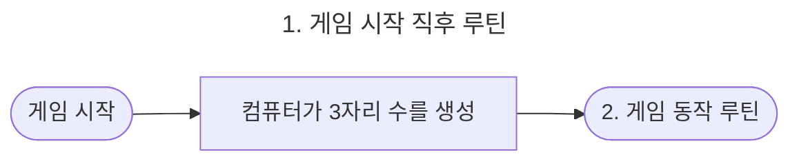
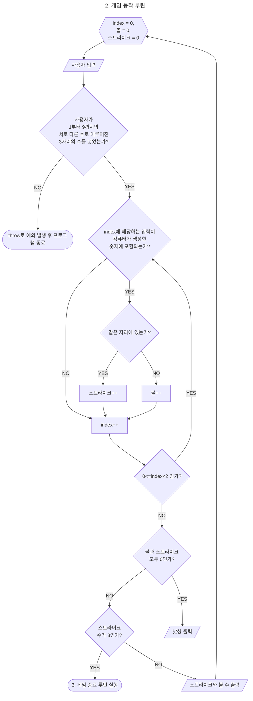
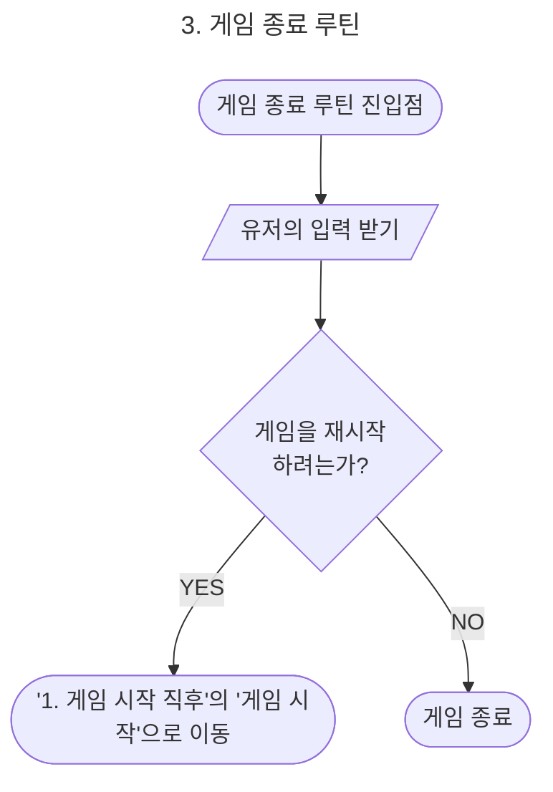
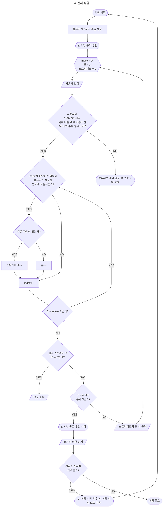

# 🖥️ 구현할 기능 목록 🖥️

## ⭕️ 0. 개요

### 💡 수강생 정보
- 작성자(프리코스 참여자) : 임재도 (Lim, Jaedo)
    - 깃허브 아이디 : Project-OAO
    - 연락처 : ashgrayblue0@gmail.com

 

### 💡 목차
  1. 기능 요구 사항 및 시나리오 분석 
  2. 프로그램 목표 
  3. 사용자 관점을 기반으로 시나리오 분석 (mermaid를 사용하여 UML 방식으로 그림)  
      3.1. 게임 시작 직후 루틴 
      3.2. 게임 동작 루틴 
      3.3. 게임 종료 루틴 
      3.4. 전체 종합

   

## ⭕️ 1. 기능 요구 사항 분석 및 설계

- 사용자 시나리오를 바탕으로 해서, 순서도를 바탕으로 구현해야하는 기능을 파악한다.
- 굵직한 흐름만을 표기하였으며, 연관된 세부 기능(변수나 함수 호출 등)은 개발을 진행하면서 맞춰가도록 한다.
- 구현할 기능 목록은 곧, 흐름도에 있는 각 요소들과 같다.

### ⭕️ 2. 프로그램 목표
- 1부터 9까지 서로 다른 수로 이루어진 3자리의 수를 맞추는 게임

   
### ⭕️ 3. 사용자 관점을 기반으로 시나리오 분석 (mermaid 를 사용하여 UML 방식으로 그림)
- 구현할 기능 목록을 작성하기에 앞서서 사용자가 프로그램을 사용할 때를 중점으로 해서 프로그램이 어떻게 동작해야 하는지 흐름도를 그린다.
- 그 이후 각 흐름도에 맞춰서 기능을 명세한다.

   
### 💡 3.1. 게임 시작 직후 루틴

- 처음 사용자가 게임을 실행했을 때의 흐름이다.
- 컴퓨터가 난수를 사용해서 1~9까지 서로 다른 3개의 수를 생성한다.
- 이때, 난수는 각각 생성해서 크기가 3인 배열 0, 1, 2번 인덱스에 넣는다.
- 이를 통해 비교할 때 인덱스를 바탕으로 비교할 수 있게 한다.
- 생성이 끝나면 사용자가 플레이할 수 있도록 "2. 게임 동작 루틴"으로 넘어간다.

   
### 💡 3.2. 게임 동작 루틴

- 위 그림에서 index는 사용자 입력을 배열로 바꿧을 경우의 index를 의미한다.
- 예 : 425라는 숫자가 있을 경우, index=0 은 4, index=1은 2, index=2는 5이다.
- 에러 문구의 경우 [ERROR] 로 시작해야 한다.
    - 예:  [ERROR] 숫자가 잘못된 형식입니다.

   
### 💡 3.3. 게임 종료 루틴

   

### 💡 3.4. 전체 종합

- 전체 과정을 종합하면 아래와 같다.
- 그림이 긴 관계로 글을 접어두었다. 펼치기를 통해서 보면 된다.

