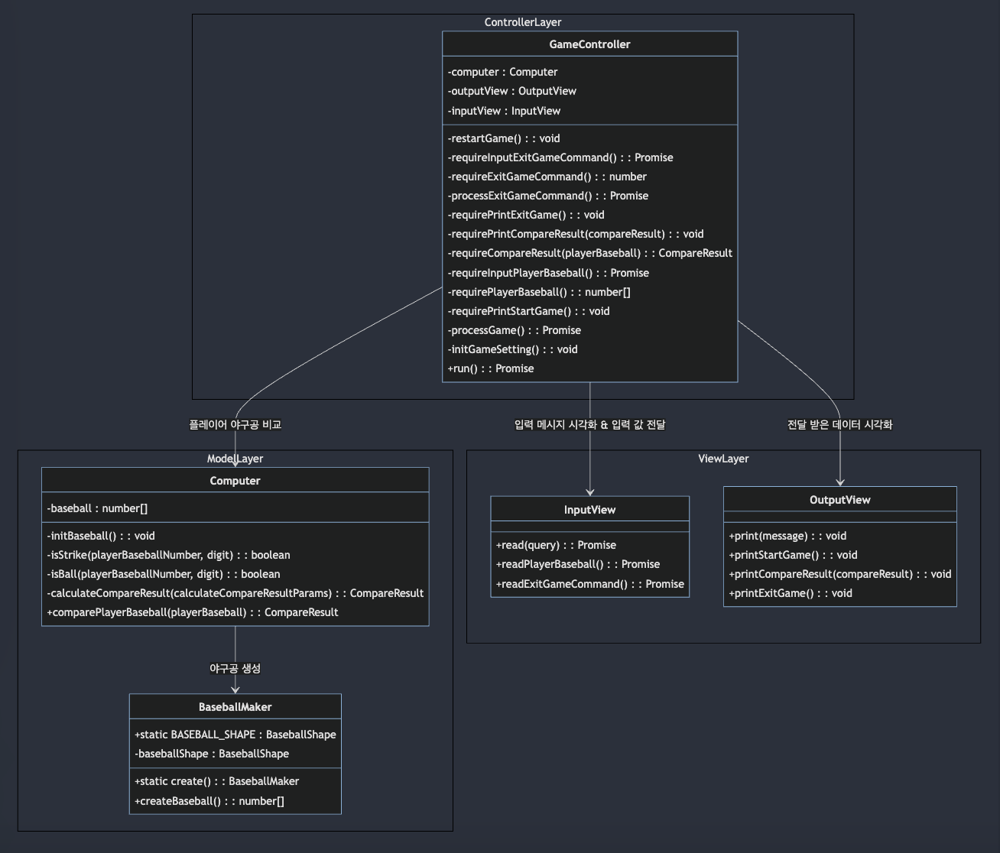

# 🚀 기능 구현 목록

## 컴퓨터 숫자 설정 기능(phase 1)

- 컴퓨터는 1에서 9까지 서로 다른 임의의 수 3개를 선택할 수 있어야 한다.

## 숫자 입력 기능(phase 2)

- 입력 전 "숫자 야구 게임을 시작합니다."라는 메시지가 출력되어야 한다.
- 유저는 1에서 9까지 서로 다른 3개의 숫자를 입력할 수 있어야 한다.
  - 아무것도 입력되지 않은 경우 "아무것도 입력하지 않았으므로 다시 입력해주세요."라는 메시지와 함께 프로그램이 완전히 종료된다.
  - 입력한 숫자에 공백이 존재하는 경우 "입력한 숫자에 공백이 존재합니다."라는 메시지와 함께 프로그램이 완전히 종료된다.
  - 숫자 이외 다른 값이 존재할 경우 "숫자만 입력이 가능합니다"라는 메시지와 함께 프로그램이 완전히 종료된다.
  - 입력한 숫자가 3자리가 아닌 경우 "숫자는 3자리만 가능합니다."라는 메시지와 함께 프로그램이 완전히 종료된다.
  - 입력한 숫자가 1~9 이외 다른 값이 존재한다면 "입력한 숫자는 1~9의 범위를 가져야 합니다."라는 메시지와 함께 프로그램이 완전히 종료된다.
  - 입력한 숫자에 중복된 값이 존재할 경우 "서로 다른 3자리의 숫자만 입력이 가능합니다."라는 메시지와 함께 프로그램이 완전히 종료된다.

## 숫자 비교 기능(phase 3)

- 컴퓨터는 게임 플레이어의 숫자의 각 자릿수를 비교할 수 있어야 한다.
  - 같은 수가 같은 자리에 있으면 스트라이크이다.
  - 같은 수가 다른 자리에 있으면 볼이다.
  - 같은 수가 전혀 없으면 낫싱이다.

## 결과 확인 기능(phase 4)

- 컴퓨터는 게임 플레이어가 입력한 숫자에 대한 결과를 출력할 수 있어야 한다.
- 컴퓨터가 선택한 3개의 숫자를 모두 맞히면 게임이 종료되며, 맞히지 못했을 경우 다시 게임 플레이어의 숫자를 입력 받을 수 있어야 한다.

## 게임 종료 기능(phase 5)

- 게임을 종료한 후 게임을 다시 시작하거나 완전히 종료 할 수 있다.
  - 1을 누를 경우 게임이 새로 시작되어야 한다.
  - 2를 누를 경우 게임이 완전히 종료 될 수 있어야 한다.
  - 1과 2 이외의 다른 값이 입력 된 경우 에러 메시지와 함께 종료되어야 한다.

## 예외 처리 (공통)

- 사용자가 잘못된 값을 입력한 경우 throw문을 사용해 예외를 발생시킨후 애플리케이션은 종료되어야 한다.

# 🔥 미션 목표 설정

## 미션 내 객체 지향 패러다임 적용하기

- [x] 애플리케이션 설계 시 각 객체간 역할, 협력, 책임을 고려하여 MVC 패턴으로 설계하기
- [x] 책임 주도 설계를 통해 각 객체가 setter/getter를 가지지 않도록 하기
- [x] 각 모듈에 대해 높은 응집도와 낮은 결합도를 고려하기
- [x] 비즈니스 로직과 UI 로직을 분리하기

## 나만의 클린 코드 원칙 지키기

### 다수의 개발자가 쉽게 이해할 수 있는 코드

- [x] 이름만 보고도 목적이나 기능을 알 수 있도록 명확하게 작명하기
- [x] 축약된 네이밍을 지양하기
- [x] else 예약어를 쓰지 않기
- [x] 메소드의 인자 수를 3개 이하로 사용하기
- [x] jsDoc, Class Diagram, Flow Chart 등과 같은 시각화 자료 활용하기

### 코드 일관성이 잘 유지되고 있는 코드

- [x] 자바스크립트 코드 컨벤션을 올바르게 사용하기
- [x] 나만의 네이밍 컨벤션을 만들어 관리하기
- [x] Linting 및 코드 포맷터 도구 활용하기

### 재 사용 및 유지 보수하기 쉽고 테스트하기 쉬운 코드

- [x] 메소드가 한가지 일만 담당하도록 구현하기
- [x] 클래스를 작게 유지하기 위해 노력하기
- [x] 매직 리터럴 / 매직 넘버 사용을 자제하고 상수를 사용하기
- [x] 빌트인 메서드를 최대한 활용하기
- [x] 중복된 코드를 최대한 중앙화 시키기

## ES6+ 문법 사용하기

- [x] function 키워드 대신 화살표 함수 사용하기
- [x] 생성자 함수 대신 class 사용하기
- [x] 객체 내 축약된 메서드 표현 사용하기
- [x] 문자열 연결 연산자 대신 템플릿 리터럴 사용하기
- [x] 구조 분해 할당 적용하기
- [x] 상황에 따라 스프레드 문법 적용하기
- [x] var 대신 let과 const 사용하기

## 의미 있는 테스트 코드 만들기

- [x] 예외 케이스 테스트 하기
- [x] 경계 조건 테스트 하기
- [x] 파라미터화 테스트를 통해 다양한 테스트 케이스 생성하기

# 📂 디렉토리 구조

```plain text
📂 javascript-baseball-6
│
├── 📂 __tests__ - 프로젝트 내의 테스트 코드 들을 포함하는 디렉토리
│ ├── 📂 errors
│ │ └── AppError.test.js
│ ├── 📂 model
│ │ ├── BaseBallMaker.test.js
│ │ └── Computer.test.js
│ ├── 📂 utils
│ │ └── Random.test.js
│ ├── 📂 validator
│ │ └── ApplicationTest.js
│
├── 📂 docs - 기능 구현 목록, 미션 목표, 클래스 다이어그램, 폴더 구조, 플로우 차트 등을 관리하는 디렉토리
│ └── README.md
│
├── 📂 src
│ ├── 📂 constants - 프로젝트에서 사용하는 고정된 값이나 설정 값들을 관리하는 디렉토리
│ │ ├── gameTerms.js
│ │ ├── message.js
│ │ └── symbols.js
│ ├── 📂 controller - Controller Layer를 관리하는 디렉토리
│ │ └── GameController.js
│ ├── 📂 errors - 커스텀 에러 클래스 들을 관리하는 디렉토리
│ │ └── AppError.js
│ ├── 📂 model - Model Layer를 관리하는 디렉토리
│ │ ├── BaseballMaker.js
│ │ ├── Computer.js
│ │ └── index.js
│ ├── 📂 utils - 프로젝트에서 사용하는 유틸 함수 들을 관리하는 디렉토리
│ │ └── random.js
│ ├── 📂 validator - 입력값의 유효성을 검사하는 validator 들을 관리하는 디렉토리
│ │ ├── BaseballValidator.js
│ │ ├── CommonValidator.js
│ │ ├── ExitGameCommandValidator.js
│ │ └── index.js
│ └── 📂 views - View Layer를 관리하는 디렉토리
│ │ ├── InputView.js
│ │ ├── OutputView.js
│ │ └── index.js
│ └── App.js
```

# 💻 클래스 다이어그램



# 📈 플로우 차트


