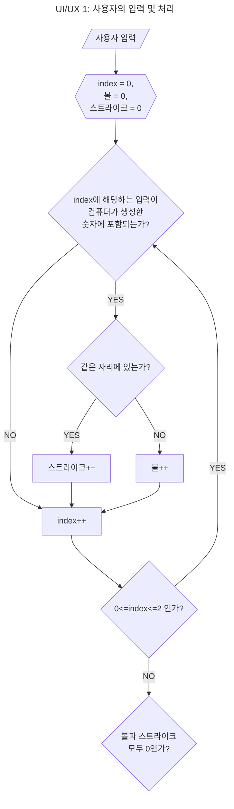

# 🖥️ 구현할 기능 목록 🖥️

## ⭕️ 0. 개요

- 작성자(프리코스 참여자) : 임재도 (Lim, Jaedo)
    - 깃허브 아이디 : Project-OAO
    - 연락처 : ashgrayblue0@gmail.com

 

- 작성 항목
  1. 기능 요구 사항 분석 및 설계
  2. 프로그래밍 요구 사항 분석
  3. 과제 진행 요구 사항 분석

## ⭕️ 1. 기능 요구 사항 분석 및 설계

### 💡 1.1. 프로그램 목표
- 1부터 9까지 서로 다른 수로 이루어진 3자리의 수를 맞추는 게임

### 💡 1.2. 사용자 관점을 기반으로 시나리오 분석 (mermaid 를 사용하여 UML 방식으로 그림)
- 구현할 기능 목록을 작성하기에 앞서서 사용자가 프로그램을 사용할 때를 중점으로 해서 프로그램이 어떻게 동작해야 하는지 흐름도를 그린다.
- 그 이후 각 흐름도에 맞춰서 기능을 명세한다.

   

- 위 그림에서 index는 사용자 입력을 배열로 바꿧을 경우의 index를 의미한다.
- 예 : 425라는 숫자가 있을 경우, index=0 은 4, index=1은 2, index=2는 5이다.