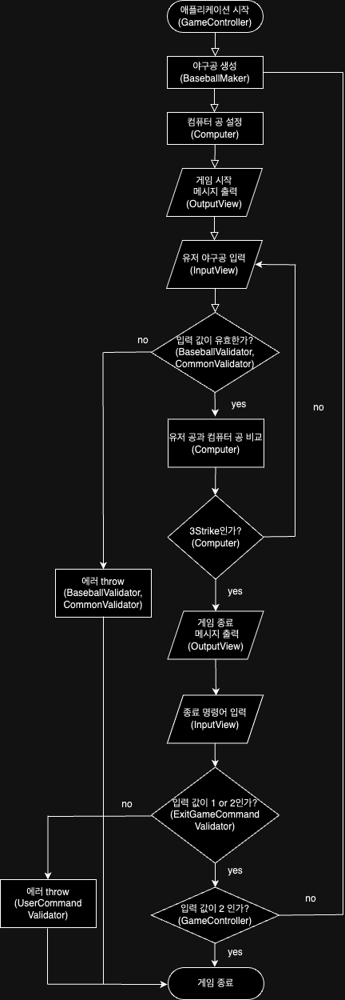

# 기능 구현 목록

## flowchart

기능 요구 분석을 위한 게임 흐름 작성

## 필요한 기능, 유저 스토리

### 게임의 정답에 해당하는 랜덤 수 생성하는 기능

유저는 입력한 숫자 3자리와 랜덤한 숫자 3자리를 비교할 수 있다.

\*랜덤 수 의경우 @woowacourse/mission-utils 를 사용한다.

### 유저의 입력값을 받는 기능

유저는 터미널을 통해 3자리의 숫자를 입력할 수 있다.

\* 메세지의 입력은 @woowacourse/mission-utils의 Console.readLineAsync를 사용한다.

### 유저의 입력값과 게임의 정답 값을 비교하는 기능

유저는 입력한 숫자를 통해 같은 자리수면 스트라이크 아니면 볼 이라는 메세지의 힌트를 받고 계속 게임을 이어나갈 수 있다.

- 메세지 출력은 @woowacourse/mission-utils 의 Console.print를 활용한다.

### 정답일경우 게임종료/다시 시작 문구 출력 기능

유저는 3스트라이크로 정답을 맞췄을 경우 1 번으로 재시작하거나 2번으로 게임을 종료 할 수 있다.

### 에러 처리 기능

유저는 게임의 의도에 벗어났거나 제공되지 않는 기능을 시도할 겅우 에러메세지를 통해 행동 가이드를 받을 수 있다.
