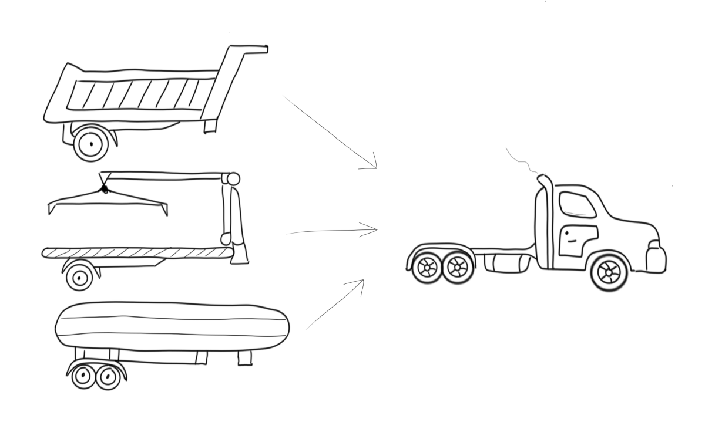
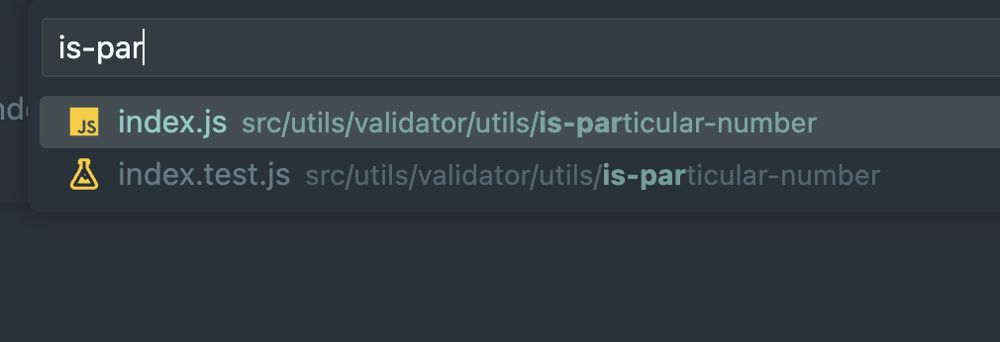

# Refactoring

> 고민을 많이 했던 리팩터링 내용을 정리했습니다.

## [A-1] refactor: validator 구조 변경

처음에 저의 validator는 아래와 같았습니다.

### 리팩터링 전

> validator/index.js

```js
import {
  checkString,
  checkZero,
  checkDuplication,
  checkThreeDigitNumber,
  checkOnlyOneOrTwo,
} from './unit.js';

const Validators = {
  checkGameNumbers(input) {
    checkString(input);
    checkZero(input);
    checkDuplication(input);
    checkThreeDigitNumber(input);
  },

  checkGameCommand(input) {
    checkOnlyOneOrTwo(input);
  },
};

export default Validators;
```

> validator/unit.js

```js
import { ERROR_MESSAGE } from '../../constants/Messages.js';
import ValidationError from '../error/ValidationError.js';

/**
 * input 값이 문자라면 에러 발생
 * @param {string} inputNumber
 */
export const checkString = (inputNumber) => {
  if (Number.isNaN(Number(inputNumber))) {
    throw new ValidationError(ERROR_MESSAGE.STRING);
  }
};

/**
 * input 값에 0이 포함되면 에러 발생
 * @param {string} inputNumber
 */
export const checkZero = (inputNumber) => {
  if (inputNumber.match(/0+/g)) {
    throw new ValidationError(ERROR_MESSAGE.ZERO);
  }
};

/**
 * input 값에 중복된 값이 포함되면 에러 발생
 * @param {string} inputNumber
 */
export const checkDuplication = (inputNumber) => {
  const setInputNumber = new Set([...inputNumber]);
  if (inputNumber.length !== setInputNumber.size) {
    throw new ValidationError(ERROR_MESSAGE.DUPLICATION);
  }
};

/**
 * input 값이 3자리 숫자가 아니면 에러 발생
 * @param {string} inputNumber
 */
export const checkThreeDigitNumber = (inputNumber) => {
  if (inputNumber.length !== 3) {
    throw new ValidationError(ERROR_MESSAGE.THREE_DIGIT);
  }
};

/**
 *  input 값이 1 또는 2가 아니면 에러 발생
 * @param {string} inputNumber
 */
export const checkOnlyOneOrTwo = (inputNumber) => {
  if (inputNumber !== '1' && inputNumber !== '2') {
    throw new ValidationError(ERROR_MESSAGE.ONLY_ONE_OR_TWO);
  }
};
```

구현하고 나서도 뭔가 엉성해 보였습니다. 어떻게 리팩터링 하면 코드의 품질을 더 올릴 수 있을까 곰곰히 생각하면서 코드를 계속 들여다보고 리팩터링에 관한 여러 영상 및 블로그를 찾아보았습니다. 그러던 중 우연히
프리코스 디코 `함께-나누기`에서 ["자바스크립트에서도 SOLID 원칙이 통할까?"](https://velog.io/@teo/Javascript%EC%97%90%EC%84%9C%EB%8F%84-SOLID-%EC%9B%90%EC%B9%99%EC%9D%B4-%ED%86%B5%ED%95%A0%EA%B9%8C)라는 글을 올려주셔서 보게되었습니다.

해당 글 내용중에 OCP (개방-폐쇄 원칙) 이라는 개념이 있습니다.

> 개방-폐쇄 원칙 : 소프트웨어 요소는 확장에는 열려 있으나 변경에는 닫혀 있어야 한다.
> 트럭이라는 운송수단과 뒤에 달리는 기구를 분리/결합 할 수 있는 구조를 만들어 두면 새로운 목적이 필요한 도구를 만들어야 할때 트럭 전체를 다시 만들지 않고서 뒤에 달리는 장치만 새롭게 만들어서 붙일 수 있게 됩니다.



> OCP의 원칙의 의미는 새로운 기능의 추가가 일어 났을때에는 기존코드의 수정 없이 추가가 되어야 하고, 내부메커니즘이 변경이 되어야 할대에는 외부의 코드 변화가 없어야 한다 라는 것 입니다.

이를 바탕으로 제 코드를 보았을 때 `checkOneOrTwo()`와 같은 함수는 만약 종료 할때 받아야 하는 input값이 `1` or `2` 가 아니라 `3` or `4` 이면 함수 이름을 교체해야 하고 if문 조건도 변경해야하고 에러 메시지도 변경해야 합니다. 즉 작은 변화가 있을 때 다 바꿔야 합니다.
`checkThreeDigitNumber()`와 `checkZero()` 도 만찬가지였습니다. 그래서 이러한 변화에 큰 영향을 받지 않도록 리팩터링 하였습니다.

### 리팩터링 후

> validator/index.js

```js
import { ERROR_MESSAGE } from '../../constants/Messages.js';
import { isDuplication, isExactLength, isNumber, isParticularNumber } from './utils/index.js';
import ValidationError from '../error/ValidationError.js';
import { GAME_COMMAND, GAME_NUMBER } from '../../constants/System.js';

const Validators = {
  checkGameNumbers(input) {
    const { number, exclude, duplication, length } = ERROR_MESSAGE;
    if (!isNumber(input)) throw new ValidationError(number);
    if (isParticularNumber(input, GAME_NUMBER.without_number)) {
      throw new ValidationError(exclude(GAME_NUMBER.without_number));
    }
    if (isDuplication(input)) throw new ValidationError(duplication);
    if (!isExactLength(input, GAME_NUMBER.length)) {
      throw new ValidationError(length(GAME_NUMBER.length));
    }
  },

  checkGameCommand(input) {
    const { restart, end } = GAME_COMMAND;
    if (!(isParticularNumber(input, restart) || isParticularNumber(input, end))) {
      throw new ValidationError(ERROR_MESSAGE.game_command(restart, end));
    }
  },
};

export default Validators;
```

> validator/utils/is-duplication/index.js

```js
/**
 * @param {string} input
 * @returns {boolean}
 */
export default function isDuplication(input) {
  const inputSet = new Set([...input]);
  return input.length !== inputSet.size;
}
```

```text
validator
┣ 📂utils
┃ ┣ 📂is-duplication
┃ ┃ ┣ 📜index.js
┃ ┃ ┗ 📜index.test.js
┃ ┣ 📂is-exact-length
┃ ┃ ┣ 📜index.js
┃ ┃ ┗ 📜index.test.js
┃ ┣ 📂is-number
┃ ┃ ┣ 📜index.js
┃ ┃ ┗ 📜index.test.js
┃ ┣ 📂is-particular-number
┃ ┃ ┣ 📜index.js
┃ ┃ ┗ 📜index.test.js
┃ ┗ 📜index.js
┗ 📜index.js
```

디렉토리 구조를 이와 같이 한 이유는 이전에 toss/slash에 작은 기여를 하면서 [validators 폴더](https://github.com/toss/slash/tree/main/packages/common/validators/src/validators)를 구경한 적이 있는데 그 당시 인상 깊었고 해당 [pr](https://github.com/toss/slash/pull/56)도 확인 했었는데 거기에는 왜 이런 구조로 만들었는지 이유가 기록되어있는데 그걸 보고 좋은 방법이라 생각이 들어서 나중에 사용해보자 생각했었습니다.

이유는 아래와 같습니다.

1. 늘 같이 편집될 거라 생각해서 최대한 가깝게 두는 게 더 나은 선택일 것 같아서 의도적으로 소스 코드, 테스트 코드를 동일한 디렉터리에 배치하였습니다. (멀리 떨어져 있으면 일부 파일을 편집하는 것을 잊어버릴 수도 있습니다. 모든 문서와 테스트 사례가 최신 상태였으면 좋겠습니다. )

2. 추가, 삭제, 수정이 용이합니다.

3. vscode에서 Cmd+p를 찾아서 파일을 찾는 경우 이전에 `unit.js`에 모두 담아서 놓는 것보다 훨씬 빠르게 파일 찾기가 가능합니다.



```js
compareUserWithComputerNumbers(userNumbers) {
    return [...userNumbers].reduce((acc, userNumber, index) => {
        const isBall = this.#computerNumbers.includes(Number(userNumber));
        const isStrike = isBall && Number(userNumber) === this.#computerNumbers[index];
        if (isStrike) {
          acc.strike += 1;
        } else if (isBall) {
          acc.ball += 1;
        }
        return acc;
      }, { ball: 0, strike: 0 },
    );
  }
```

---

## [A-2] refactor(Model): if else 대신 if로 변경

else 사용을 지양해야하지만 아래와 같은 경우 고민이 많았습니다.
평소에 `else` 는 필요한 상황이 아니면 지양했고 `if else`는 더더욱 사용하지 않았습니다.
하지만 이 상황에서는 `else if`가 더 가독성이 좋아 보였습니다.
마지막에 리턴 값이 다르거나 존재하지 않았다면 `if`문만 사용했을 것 같습니다.
하지만 결국 고민하다 `if`문을 사용했습니다.

### 리팩터링 전

```js
compareUserWithComputerNumbers(userNumbers) {
    return [...userNumbers].reduce((acc, userNumber, index) => {
        const isBall = this.#computerNumbers.includes(Number(userNumber));
        const isStrike = isBall && Number(userNumber) === this.#computerNumbers[index];

        if (isStrike) {
          acc.strike += 1;
        } else if (isBall) {
          acc.ball += 1;
        }
        return acc;
      }, { ball: 0, strike: 0 },
    );
  }
```

### 리팩터링 후

```js
compareUserWithComputerNumbers(userNumbers) {
    return [...userNumbers].reduce((acc, userNumber, index) => {
        const isBall = this.#computerNumbers.includes(Number(userNumber));
        const isStrike = isBall && Number(userNumber) === this.#computerNumbers[index];

        if (isStrike) {
          acc.strike += 1;
          return acc
        }

        if (isBall) {
          acc.ball += 1;
        }

        return acc;
      }, { ball: 0, strike: 0 },
    );
  }
```

---

## [A-3] refactor: 하나의 view에서 InputView, OutputView로 분리

이전에는 만약 패키지를 변경하거나 업데이트 해야하는 상황에서 의도한 결과값과 다르게 나온다면 InputView, OutPutView에서 약간의 조작으로 view/index.js에 있는 함수들이 영향을 받지 않도록 수정을 한다는 생각을 가지고 있었습니다.
하지만 만약 서비스가 더 커져서 view안에 더 많은 함수가 생기면 헷갈리고 유지보수하기에 감당이 되지 않을 것 같아서 InputView, OutputView로 분리했습니다.

### 리팩터링 전

> view/index.js

```js
import { HINT, OUTPUT_MESSAGES } from '../constants/Messages.js';
import OutputView from './OutputView.js';
import Validators from '../utils/validator/index.js';
import InputView from './InputView.js';

const View = {
  print(message) {
    OutputView.print(message);
  },

  printStart() {
    OutputView.print(OUTPUT_MESSAGES.game_start);
  },

  printSuccess() {
    OutputView.print(OUTPUT_MESSAGES.game_success);
  },

  async readGameNumbers() {
    const userNumbers = await InputView.readLineAsync(OUTPUT_MESSAGES.game_number);
    Validators.checkGameNumbers(userNumbers);
    return userNumbers;
  },

  async readGameCommand() {
    const userAnswer = await InputView.readLineAsync(OUTPUT_MESSAGES.game_command);
    Validators.checkGameCommand(userAnswer);
    return userAnswer;
  },

  printHint({ ball, strike }) {
    if (ball === 0 && strike === 0) {
      OutputView.print(HINT.nothing);
    } else {
      const message = HINT.message(ball, strike);
      const hint = message.replace(HINT.clear, '').trim();
      OutputView.print(hint);
    }
  },
};

export default View;
```

```js
import { Console } from '@woowacourse/mission-utils';

const InputView = {
  /**
   * 주어진 질문을 화면에 출력하고, 사용자가 입력한 답변을 Promise를 통해 반환한다.
   * @param {string} message - 사용자에게 보여줄 질문
   * @returns {string} userInput
   */
  async readLineAsync(message) {
    const userInput = await Console.readLineAsync(message);
    return userInput;
  },
};

export default InputView;
```

```js
import { Console } from '@woowacourse/mission-utils';

const OutputView = {
  /**
   * 주어진 문자열을 콘솔에 출력한다.
   * @param {string} message - 출력할 메시지
   */
  print(message) {
    Console.print(message);
  },
};

export default OutputView;
```

### 리팩터링 후

> view/InputView.js

```js
import { Console } from '@woowacourse/mission-utils';
import Validators from '../utils/validator/index.js';
import { OUTPUT_MESSAGES } from '../constants/Messages.js';

const InputView = {
  /**
   * 주어진 질문을 화면에 출력하고, 사용자가 입력한 답변을 Promise를 통해 반환한다.
   * @param {string} message - 사용자에게 보여줄 질문
   * @returns {string} userInput
   */
  async readLineAsync(message) {
    const userInput = await Console.readLineAsync(message);
    return userInput;
  },

  async readGameNumbers() {
    const userNumbers = await InputView.readLineAsync(OUTPUT_MESSAGES.game_number);
    Validators.checkGameNumbers(userNumbers);
    return userNumbers;
  },

  async readGameCommand() {
    const userAnswer = await InputView.readLineAsync(OUTPUT_MESSAGES.game_command);
    Validators.checkGameCommand(userAnswer);
    return userAnswer;
  },
};

export default InputView;
```

> view/OutputView.js

```js
import { Console } from '@woowacourse/mission-utils';
import { HINT, OUTPUT_MESSAGES } from '../constants/Messages.js';

const OutputView = {
  /**
   * 주어진 문자열을 콘솔에 출력한다.
   * @param {string} message - 출력할 메시지
   */
  print(message) {
    Console.print(message);
  },

  printStart() {
    OutputView.print(OUTPUT_MESSAGES.game_start);
  },

  printSuccess() {
    OutputView.print(OUTPUT_MESSAGES.game_success);
  },

  /**
   * @typedef {object} score
   * @property {number} ball
   * @property {number} strike
   */

  /** @type {score} */
  printHint({ ball, strike }) {
    if (ball === 0 && strike === 0) {
      OutputView.print(HINT.nothing);
    } else {
      const message = HINT.message(ball, strike);
      const hint = message.replace(HINT.clear, '').trim();
      OutputView.print(hint);
    }
  },
};

export default OutputView;
```

> view/index.js

```js
export { default as InputView } from './InputView.js';
export { default as OutputView } from './OutputView.js';
```

---

## [A-4]

기존에 테스트 코드 때문에 `saveComputerNumbers()` 메서드가 불필요하게 들어가게 되었습니다.
외부에서 `this.#computerNumbers`를 외부에서 접근할 수 없기에 임시방편으로 추가했지만 이는 잘못사용되면 앱 전체가 잘못되기에 테스트만을 위해서 남겨두기에는 너무 위험했습니다.
따라서 이를 제거하고 컨트롤러에서 인수를 통해서 전달하도록 변경하였습니다.

### 리팩터링 전

> src/model/index.js

```js
import GameNumberGenerator from './GameNumberGenerator.js';
import GameNumberGeneratorError from '../utils/error/GameNumberGeneratorError.js';
import Validators from '../utils/validator/index.js';
import { ERROR_MESSAGE } from '../constants/Messages.js';
import { SYSTEM } from '../constants/System.js';

class BaseballModel {
  /**
   * @private
   * @type {number[]}
   */
  #computerNumbers;

  constructor() {
    this.#computerNumbers = [];
  }

  generateGameNumbers() {
    try {
      const randomGameNumbers = GameNumberGenerator();
      Validators.checkGameNumbers(randomGameNumbers.join(''));
      this.saveComputerNumbers(randomGameNumbers);
    } catch (error) {
      throw new GameNumberGeneratorError(
        ERROR_MESSAGE.game_number_generator(
          SYSTEM.game_number_range_start,
          SYSTEM.game_number_range_end,
          SYSTEM.game_number_count,
        ),
      );
    }
  }

  /**
   * @param {number[]} data
   */
  saveComputerNumbers(data) {
    this.#computerNumbers = data;
  }

  ...
}
```

> src/controller/index.js

```js
import BaseballModel from '../model/index.js';
import { InputView, OutputView } from '../view/index.js';

class BaseBallController {
  #model;

  static RETRY = '1';

  constructor() {
    OutputView.printStart();
    this.#model = new BaseballModel();
  }

  async run() {
    this.#model.generateGameNumbers();
    await this.#guessNumber();
    const userAnswer = await InputView.readGameCommand();
    if (userAnswer === BaseBallController.RETRY) {
      this.run();
    }
  }

  // TODO : no-await-in-loop 정리
  async #guessNumber() {
    while (true) {
      const userNumbers = await InputView.readGameNumbers();
      const score = this.#model.compareUserWithComputerNumbers(userNumbers);

      OutputView.printHint(score);
      if (score.strike === 3) {
        OutputView.printSuccess();
        break;
      }
    }
  }
}

export default BaseBallController;
```

### 리팩터링 후

> src/controller/index.js

```js
import BaseballModel from '../model/index.js';
import { InputView, OutputView } from '../view/index.js';

class BaseBallController {
  static RETRY = '1';

  constructor() {
    OutputView.printStart();
  }

  async run() {
    const gameNumbers = BaseballModel.generateGameNumbers();
    await BaseBallController.#guessNumber(gameNumbers);
    const userAnswer = await InputView.readGameCommand();

    if (userAnswer === BaseBallController.RETRY) {
      this.run();
    }
  }

  // TODO : no-await-in-loop 정리
  // prettier-ignore
  /**
   * @param {number} gameNumbers
   */
  static async #guessNumber(gameNumbers) {
    while (true) {
      const userNumbers = await InputView.readGameNumbers();
      const score = BaseballModel.compareUserWithComputerNumbers(userNumbers, gameNumbers);

      OutputView.printHint(score);
      if (score.strike === 3) {
        OutputView.printSuccess();
        break;
      }
    }
  }
}

export default BaseBallController;
```

> src/model/index.js

```js
import GameNumberGenerator from './GameNumberGenerator.js';
import GameNumberGeneratorError from '../utils/error/GameNumberGeneratorError.js';
import Validators from '../utils/validator/index.js';
import { ERROR_MESSAGE } from '../constants/Messages.js';
import { SYSTEM } from '../constants/System.js';

class BaseballModel {
  static generateGameNumbers() {
    try {
      const randomGameNumbers = GameNumberGenerator();
      Validators.checkGameNumbers(randomGameNumbers.join(''));
      return randomGameNumbers;
    } catch (error) {
      throw new GameNumberGeneratorError(
        ERROR_MESSAGE.game_number_generator(
          SYSTEM.game_number_range_start,
          SYSTEM.game_number_range_end,
          SYSTEM.game_number_count,
        ),
      );
    }
  }

  // prettier-ignore
  /**
   * @param {string} userNumbers 숫자 string
   * @param {number} gameNumbers
   * @returns {{ball : number, strike : number}}
   */
  static compareUserWithComputerNumbers(userNumbers, gameNumbers) {
    return [...userNumbers].reduce((acc, userNumber, index) => {
        const isBall = gameNumbers.includes(Number(userNumber));
        const isStrike = isBall && Number(userNumber) === gameNumbers[index];
        
        if (isStrike) {
          acc.strike += 1;
          return acc
        } 
        
        if (isBall) {
          acc.ball += 1;
        }

        return acc;
      }, { ball: 0, strike: 0 },
    );
  }
}

export default BaseballModel;
```
