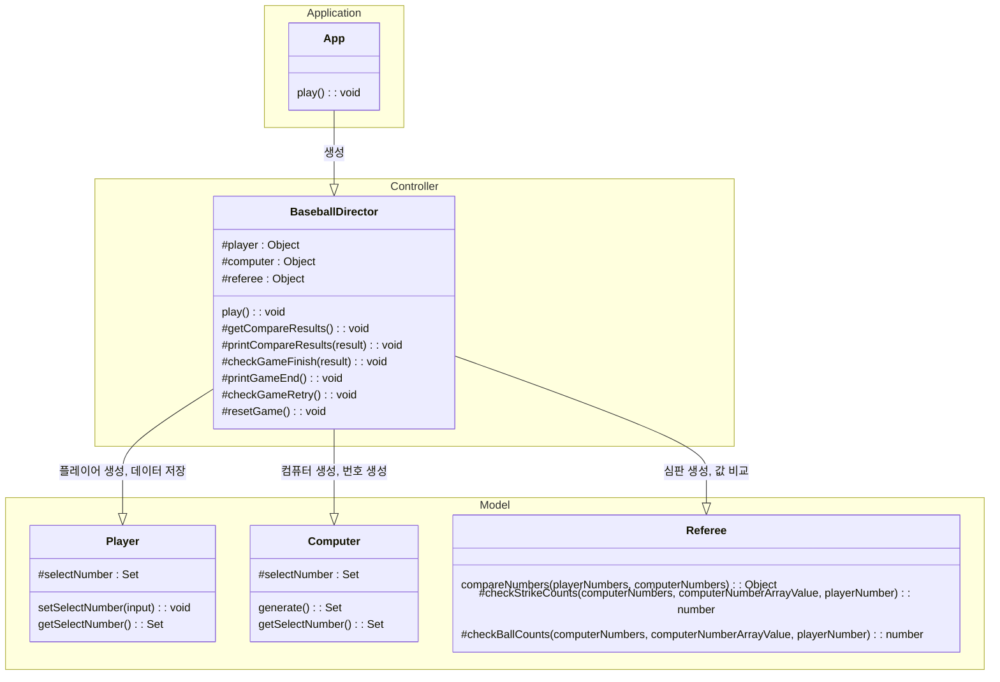
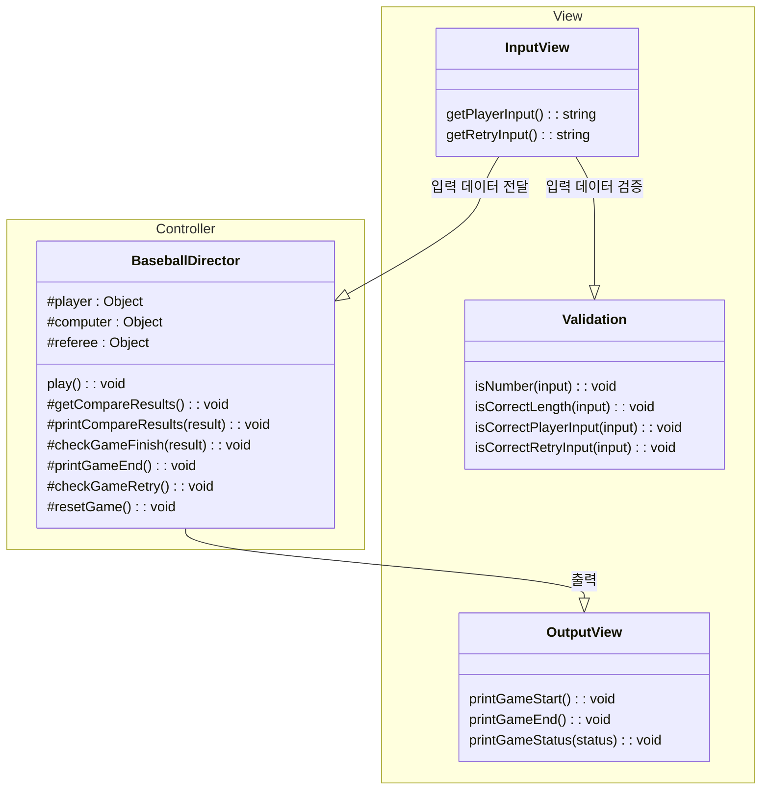
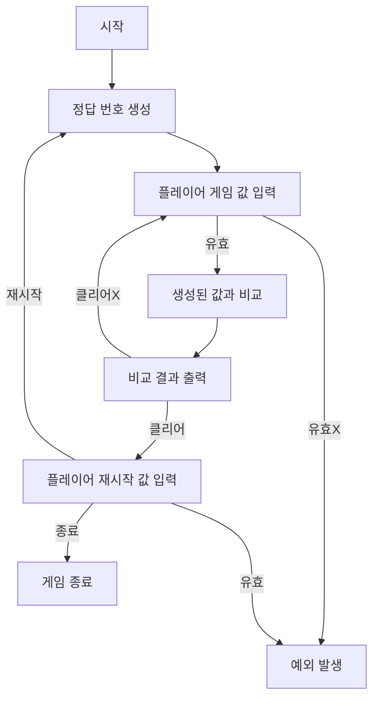

# 📚 WOOWAPRECOURCE ASSIGNMENT

# ⚾ 숫자 야구

## 📜 기능 요구사항

### Computer가 정답을 생성하는 기능

- `Mission-Utils/Random`의 `pickNumberInRange`를 활용하여 1 ~ 9까지의 번호를 세개 뽑아야한다.
- 번호들 사이에 중복은 없어야한다.

### 플레이어의 입력을 받는 기능

- 플레이어의 입력은 반드시 1 ~ 9까지의 숫자를 공백없이 3개 입력해야 한다.
- 위 조건에 부합하지 않는 값이 입력된다면 예외처리한다.

### 정답과 플레이어의 입력을 비교하는 기능

- 플레이어의 입력값과 정답을 비교하여 결과를 계산한다.
- 플레이어의 입력값이 단순히 포함되어 있으면 볼, 위치까지 일치하면 스트라이크로 계산한다.

### 게임의 진행상황을 출력하는 기능

- 게임을 시작할 때는 `숫자 야구 게임을 시작합니다.` 문구를 출력한다.
- 플레이어의 입력값과 정답을 비교한 결과를 출력한다.
  - 출력은 볼 - 스트라이크 순으로 출력한다.
  - 0스트라이크 0볼은 낫싱으로 대신하여 출력한다.

### 게임 재시작 기능

- 플레이어의 입력을 받아 재시작 여부를 처리한다.
- 플레이어의 입력은 반드시 1 또는 2여야하며, 이 조건에 부합하지 않는다면 예외처리한다.
- 재시작 시 정답 번호를 재생성하고 처음으로 돌아간다. 이 때 게임 시작 문구를 출력하지 않는다.
- 종료 선택시 프로그램을 종료한다.

### 예외 처리

- 사용자가 잘못된 값을 입력할 경우 throw문을 사용해 예외를 발생시키고, "[ERROR]"로 시작하는 에러 메시지를 출력 후 종료한다.

## 🗃️ 클래스 다이어그램





## 🌊 플로우차트



## 🗂️ 폴더 구조

```
📂 javascript-baseball-6
├─ .gitignore
├─ .npmrc
├─ README.md
├─ 📂 src
│  ├─ App.js
│  ├─ 📂 constants
│  │  ├─ GameSettings.js
│  │  └─ Message.js
│  ├─ 📂 controller
│  │  └─ BaseballDirector.js
│  ├─ 📂 docs
│  │  └─ README.md
│  ├─ 📂 model
│  │  ├─ Computer.js
│  │  ├─ Player.js
│  │  └─ Referee.js
│  ├─ 📂 utils
│  │  └─ Validation.js
│  └─ 📂 view
│     ├─ InputView.js
│     └─ OutputView.js
└─ 📂 __tests__
   ├─ ApplicationTest.js
   ├─ 📂 model
   │  ├─ ComputerTest.js
   │  ├─ PlayerTest.js
   │  └─ RefereeTest.js
   └─ 📂 utils
      └─ ValidationTest.js
```
